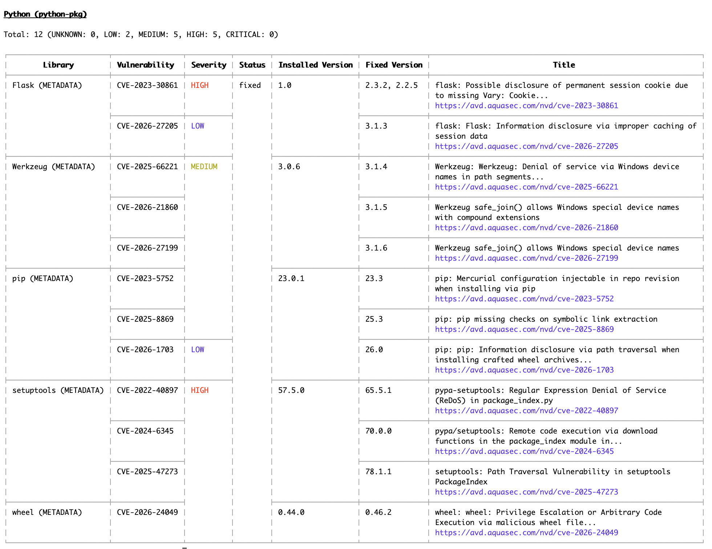
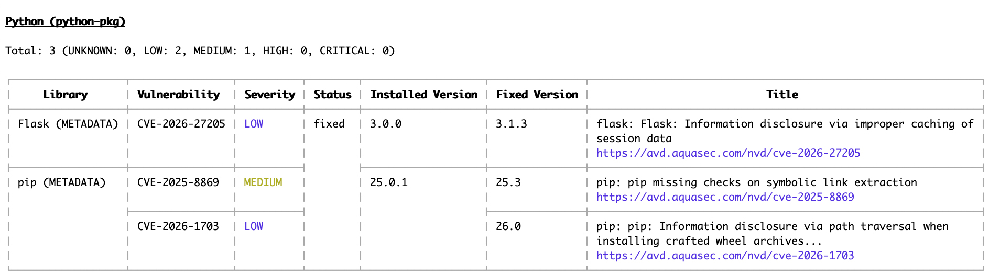
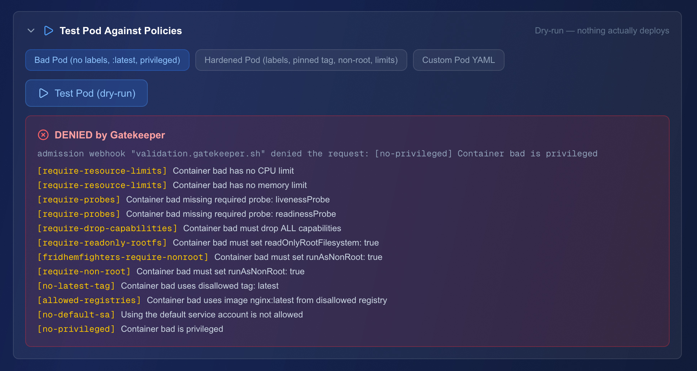
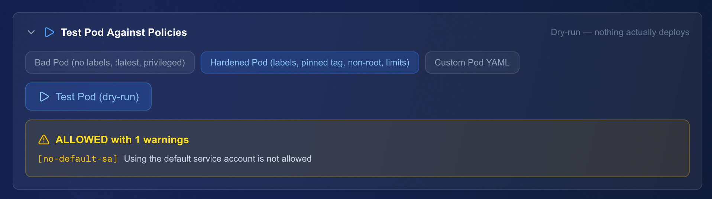
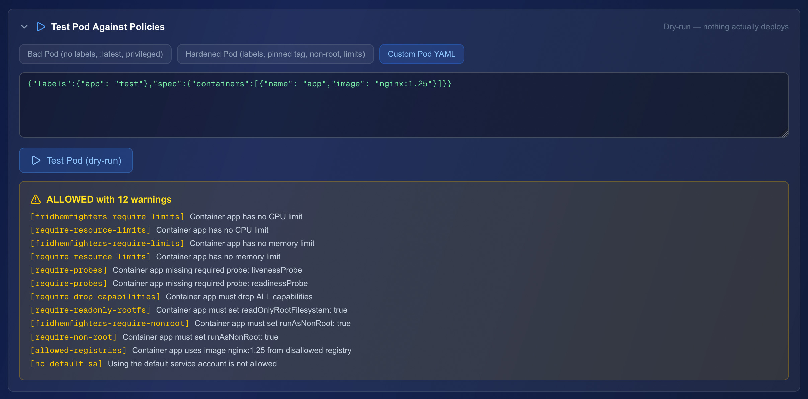
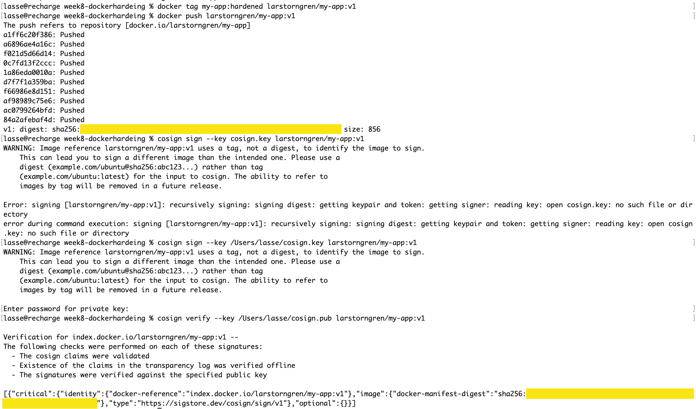
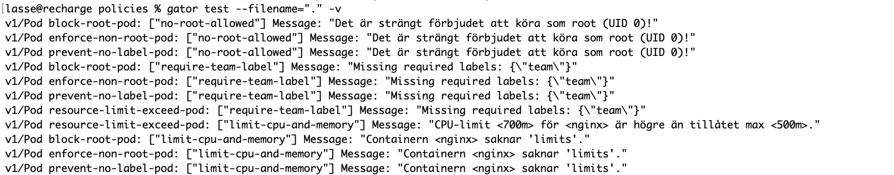

# Lab 2 Container Security

A school project with Docker, Trivy, Kubernetes

## Vad som genomförts
Jag har skapat två olika docker images. Den ena med medvetet bristande säkerhetstänkande (vulnerable image), den andra med säkerhet i åtanke (hardened image). Sedan har jag scannat respektive image med Trivy, och sparat resultatet både som en skärmdump, och som rapporter i text-format (rapport för den första imagen, före hardening, och sedan rapport för den andra imagen, efter hardening). Den härdade image-filen har jag signerat genom att lägga upp den på Docker Hub, och sedan signera med cosign (se skärmdump nedan). Därefter genererade jag med CyclonDX en SBOM (Software Bill Of Materials) för att få fram en lista på de olika komponenter som ingår i appen jag skapar. Viktigt både för spårbarhet och säkerhet. Slutligen använde jag Gatekeeper för att kunna se befintliga policies och eventuella violations i mitt namespace. Jag genomförde också ett test som jämförde en ”bad pod” med en ”hardened pod”. För att förbättra mitt projekt kompletterade jag med flera olika policies. I mappen för policies utökade jag funktionerna med ett antal test, för att kontrollera att respektive policy också ger utslag med felmeddelanden när aktuella krav inte är uppfyllda. Testen är utförda med hjälp av verktyget ”gator”. Längre ner i detta dokument finns en skärmdump från dessa test. Jag har dessutom skapat ett separat dokument med min säkerhetsstrategi, som ligger i detta repository.

## Verktyg som har använts
Verktygen jag har använt är terminalen, Docker, Trivy, VS Code, CyclonDX, Gatekeeper, gator, cosign.

## Vad lärde du dig om container-säkerhet?
Det jag lärde mig om container-säkerhet, är att ju mer man bantar bort från en image (gör den ”slim”), desto säkrare blir den container man sedan skapar från sin image. Säkrast blir det med en distroless image, eftersom det då inte finns några paket och inga systemkommandon att använda sig av för den som försöker hacka systemet. Ytterligare säkerhetsåtgärder är att skapa ett ReadOnly-filsystem, och en användare som enbart har behörighet att köra en specifik app inuti containern, som då körs som non-root.

## Varför är SBOM viktigt?
SBOM talar om vilka komponenter som finns i den app som finns i en container. Vilket är viktigt både ur felsökningsperspektiv, spårbarhet i mjukvaruutveckling och för säkerheten.

## Hur förändrar policy-enforcement (Gatekeeper) hur man jobbar med Kubernetes?
Man tvingar utvecklare att vara noggranna, och kontrollera sin kod innan man kör deployment, eftersom det annars blir så att en pod nekas vid skapandet. Det gör även att säkerhetsarbetet blir mer automatiserat och policydrivet. All mjukvara som skapas måste gå igenom policykontrollen för att bli godkänd.

## Skärmdumpar

## Cosigned docker hardened image

## Tests av policies genomförda med gator

